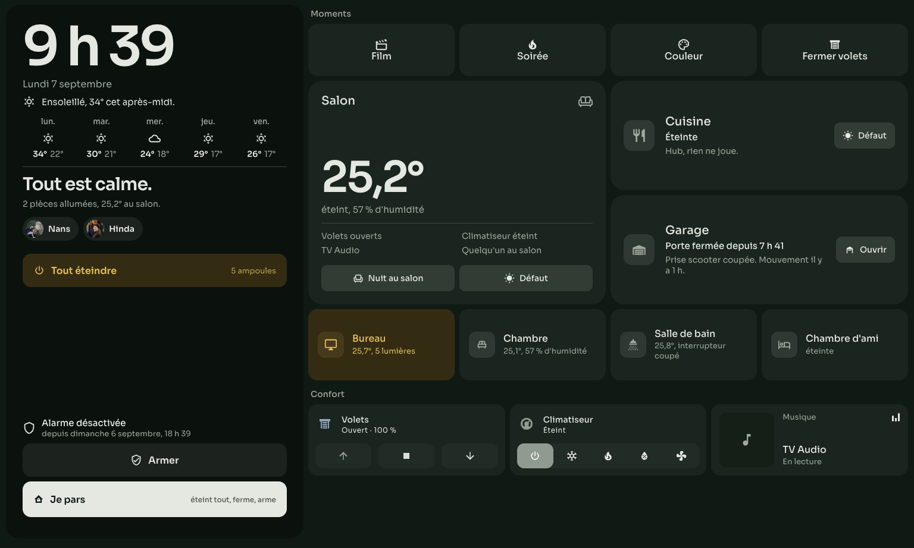
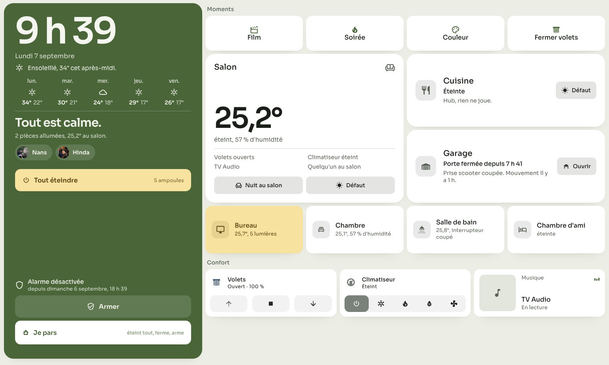
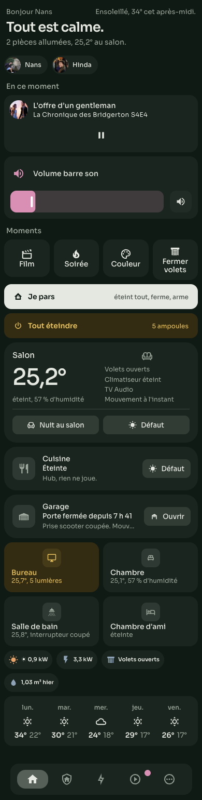
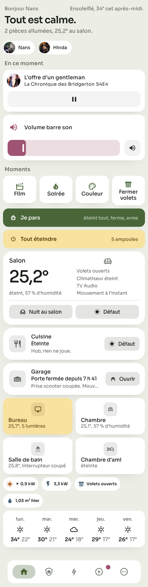

# Atelier

A Home Assistant theme where **colour means state**. Rooms stay neutral until something happens: honey when the lights are on, terracotta when a door is open. One typeface, no decorative hues, readable at 12 px in both modes.

> 🇫🇷 Thème Home Assistant né pour mes trois dashboards : le téléphone, le Mac et la tablette murale de l'entrée, qui pivote entre portrait et paysage. La couleur dit l'état, une seule famille de caractères, contrastes vérifiés. Installable via HACS.

| Night | Day |
|---|---|
|  |  |

The entrance tablet in landscape, and the same house on the phone:

| Night | Day |
|---|---|
|  |  |

## Principles

- **Colour means state.** A card is neutral at rest. `--atelier-lit-*` when a room is lit, `--atelier-warn-*` when an access is open. Tile colours (`amber`, `red`, …) are remapped to the palette so nothing shouts.
- **Two moods, one system.** Night: near-black green, honey highlights, light-neutral controls. Day: lime-wash background, white cards, olive controls.
- **One typeface.** Sora, with a system fallback stack.
- **Hierarchical radii.** Card 16, dialog 26, control 10, chip 999.
- **Contrast ≥ 4.5:1 at 12 px** in both modes, with a single secondary grey.
- **Three surfaces, one grammar.** Designed for a phone, a desktop and a wall tablet by the front door that rotates between portrait and landscape. The tablet adds a fixed side *post* for leaving and coming home (clock, weather, alarm, "I'm leaving"): the heaviest surface of each mode, with its own `--atelier-post-*` tokens.

## Installation

### HACS (recommended)

1. HACS → *Custom repositories* → add `https://github.com/NansMM/atelier-theme`, category **Theme**.
2. Install **Atelier**.
3. Make sure `configuration.yaml` loads the themes folder (restart once if you add it):
   ```yaml
   frontend:
     themes: !include_dir_merge_named themes
   ```
4. *Developer tools → Actions* → `frontend.reload_themes`.
5. Profile → Theme → **Atelier**, mode **Auto** so the device decides between night and day.

### Manual

Copy `themes/atelier.yaml` to `config/themes/`, then steps 3–5 above.

## Font

Sora is not bundled. To load it, add a dashboard resource (*Settings → Dashboards → ⋮ → Resources*):

- URL: `https://fonts.googleapis.com/css2?family=Sora:wght@400;500;600&display=swap`
- Type: **Stylesheet**

Without it the theme falls back to Avenir Next, Helvetica Neue, then the system sans-serif.

## Tokens for custom cards

Every `atelier-*` key is exposed as a CSS custom property, so cards can follow the theme without hard-coding colours:

```yaml
type: custom:button-card
styles:
  card:
    - background: "[[[ return entity.state === 'on' ? 'var(--atelier-lit-bg)' : 'var(--atelier-card)'; ]]]"
    - color: "[[[ return entity.state === 'on' ? 'var(--atelier-lit-fg)' : 'var(--atelier-text)'; ]]]"
```

| Token | Role |
|---|---|
| `--atelier-bg`, `--atelier-bg2`, `--atelier-card` | page, secondary surface, card |
| `--atelier-text`, `--atelier-text2` | primary and secondary text |
| `--atelier-primary`, `--atelier-on-primary` | interactive colour and text on it |
| `--atelier-lit-bg`, `--atelier-lit-fg`, `--atelier-lit-shadow` | a lit room |
| `--atelier-warn-bg`, `--atelier-warn-fg` | an open access |
| `--atelier-inverse-bg`, `--atelier-inverse-fg` | inverted bar (e.g. "I'm leaving") |
| `--atelier-post-bg`, `--atelier-post-fg`, `--atelier-post-fg2`, `--atelier-post-surface`, `--atelier-post-bar-bg`, `--atelier-post-bar-fg` | the heaviest surface of the mode (a wall tablet's side post), its text, its keys, its inverted bar |
| `--atelier-control`, `--atelier-dash`, `--atelier-divider`, `--atelier-shadow` | sliders, dotted outlines, dividers, elevation |
| `--atelier-c-*`, `--atelier-rgb-*` | named palette (hex, and `r, g, b` for Mushroom) |

## What this repository is not

The theme only. The button-card templates and the three dashboards it was designed for (phone, desktop, entrance tablet) are not included; they depend on button-card, card-mod, Bubble Card, Mushroom and kiosk-mode and are specific to one home.

## Licence

MIT.
